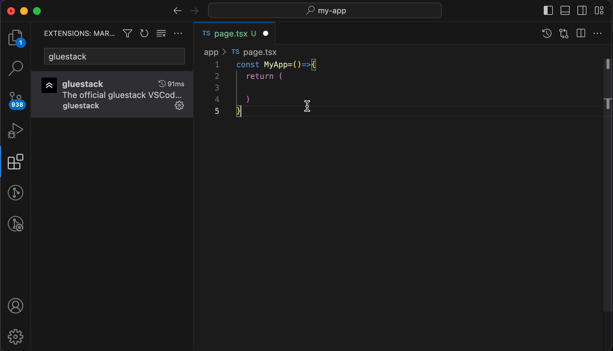

# gluestack VS Code Extensions

gluestack VS Code Extensions are specifically designed to quicken your development process using gluestack-ui components

## How Snippets Work

This extension provides working snippets that make it easy to navigate between different breakpoints by using tabs. Here's a quick look at snippets in action:

## Snippets

gluestack snippets are shorthand for commonly used gluestack components. All snippets start with the prefix gs- and are followed by the name of the desired component. It's that simple.

# gluestack-ui Snippets

gluestack-ui Snippets Extension is specifically designed to quicken your development process using gluestack-ui components

Currently it supports adding any usecase of snippet, its used imports, variables etc. If you have anyone idea, can submit `PR` or `Issue`

## Supported Languages

- JavaScript(.js)
- TypeScript(.ts)
- JavaScriptReact(.jsx)
- TypeScriptReact(.tsx)

# Usage

1. Install the extension by searching in the vscode marketplace.
2. Then, go to your code file and whereever you are writing jsx, type `gs-` and you will get suggestions of the components. Type enter on any of those, and your snippet will get added.
   Collectively, it will also add the imports and the variables and hooks used in the snippet.
